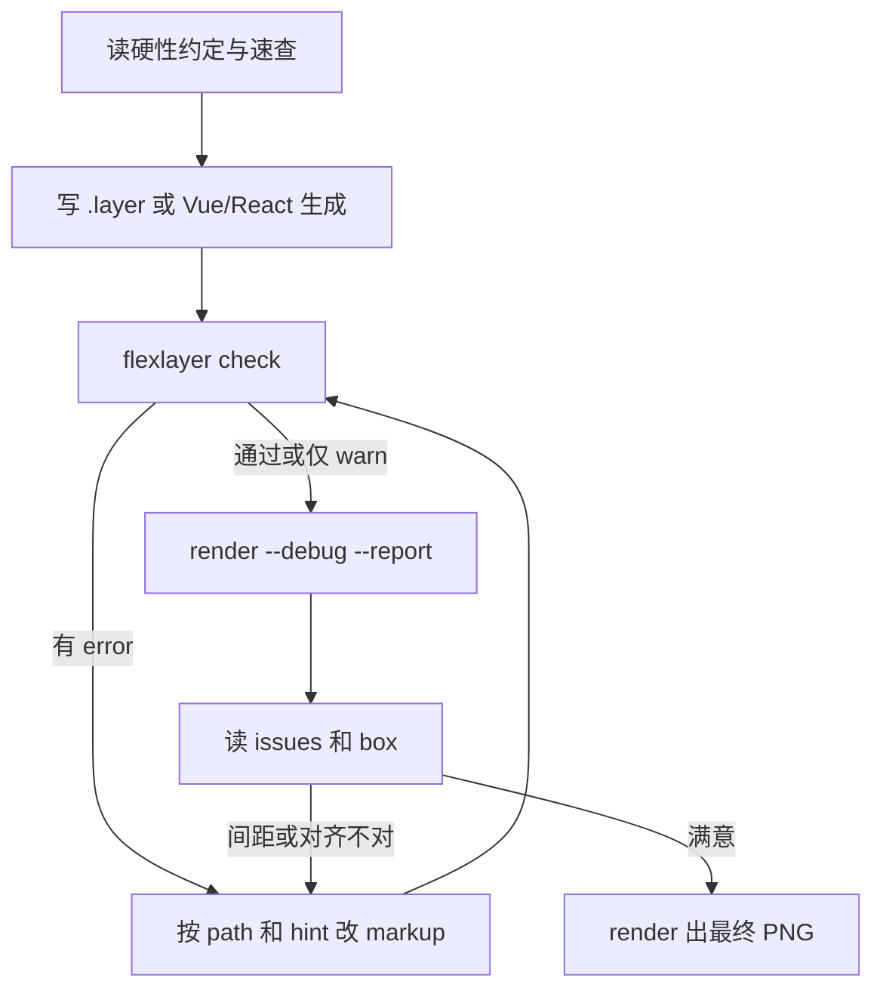

# Flex Layer：生成、验证与 AI 协作

本文是给模型的入口。标签与属性的正文只在 [SPEC.md](SPEC.md)；下面这张表是必须遵守的写法，和报告里的问题码一一对应。Vue / React 见 [GENERATE.md](GENERATE.md)；组件见 [generate/COMPONENTS.md](generate/COMPONENTS.md)；效果图见 [docs/GALLERY.md](docs/GALLERY.md)。

## 1. 三层分工

Flex Layer 把**生成**和**渲染**分开，中间只交接一份 **`.layer` 文本**：

```text
.layer 文本 ─────────────────────────▶ check / debug / render → PNG
.tsx（JSX + 代码）──执行──▶ 同一棵节点树 ──┘
                         └── --emit ──▶ .layer 文本
```

| 层 | 做什么 | 不做什么 |
| --- | --- | --- |
| **生成** | 产出合法 `.layer` 字符串 | 不算最终像素、不画 canvas |
| **验证** | 布局、问题码、元素表、调试图 | 不改源码 |
| **渲染** | 读节点树或 `.layer` → PNG + `report.json` | 不跑 Vue / React |

`.layer` 仍是渲染器读的格式。`.tsx` 只是多出来的源文件：执行后得到同一棵树，语义、问题码和绘制都不变。静态海报继续手写 `.layer`。

## 2. 硬性约定

规则正文在 SPEC。这里只列写错会怎样、应该改成什么。

| 规则 | 错误写法 | 正确写法 | 问题码 |
| --- | --- | --- | --- |
| HTML 用 `style`，`layer` 和图形用属性 | `<p font-size="40">`、`<circle style="fill:#fff">` | `<p style="font-size:40px">`、`<circle fill="#fff">` | `invalid-attr` |
| 标签一律小写 | `<Circle>`、`<Row>` | `<circle>`、`<div style="display:flex">`。大写标签会渲染并报 `info` | `non-canonical` |
| 嵌套 `layer` / `use` 不写 `background` | `<layer background="#fff">` | `<rect fill="#fff">`、HTML `background`，或 `<draw>` | `invalid-attr` |
| 排布用 `div` 的 `display:flex` | `<Column>` | `<div style="display:flex; flex-direction:column">` | `unknown-tag` |
| 线条放在 `layer` 里，用 `x1`…`d` | 线条直接放进 flex | `<layer><line x1 y1 x2 y2 /></layer>` | `invalid-child` |
| 文字的位置写在外包的 `layer` 上 | `<h1 cx="120">` | `<layer cx="120" cy="64" anchor="top-left"><h1>…</h1></layer>` | `invalid-attr` |
| 图片是 HTML | `<Image width="320">` | ``。`image` 同样可用 | `invalid-attr` |
| 作用于整棵子树的效果只写在 `layer` 上 | `<rect grade="lomo">`、`<p style="overlay:#000">` | `<layer grade="lomo" overlay="#00000066">` | `invalid-attr` |
| 调色先选预设再改一两项 | `grade="contrast 5"` | `<layer grade="lomo 0.8, fade 0.1">` | `invalid-attr` |
| 多段文字用 flex | `<p><div>…</div></p>` | `<div style="display:flex; flex-direction:column">` | `invalid-child` |
| 整层裁切用 `<mask>`，里面直接写形状或 `` | 把 mask 写成属性，或放进 flex | `<layer><mask><circle cx="160" cy="90" r="90" /></mask>…</layer>`。省略 `fill` 为不透明白 | `invalid-child` |
| 透视写在父 `layer`，转动和 `z` 写在子元素 | `<rect perspective="900" rotateY="20">` | `<layer perspective="900"><rect rotateY="20" z="40" /></layer>` | `invalid-attr`、`flatten-3d` |
| 球体、长方体、拉伸和 glb 放在带 `perspective` 的 layer 里 | `<sphere r="40">` 没有视距 | `<layer perspective="700"><sphere cx="80" cy="80" r="40" /></layer>`。`model` 只写 `src`，尺寸写在外包 layer | `flatten-3d`、`missing-model` |

根节点 `<layer width height background>` 上的 `background` 是画布底色，只有这一处可以写。

## 3. 生成

- 直接写 `.layer`：海报、单帧。速查见 [docs/CHEATSHEET.md](docs/CHEATSHEET.md)，例子在 [examples/](examples/)。
- 直接写 `.tsx`：有数据、循环、组件或动画时用。文件头写 `/** @jsxImportSource @dc/flexlayer */`，标签和属性与 `.layer` 相同，不用 import 这些标签。默认导出 `<layer>` 或返回它的函数；动画则导出 `composition`（见 SPEC 第 13 章）。`flexlayer check` / `render` 会执行它。`--emit out.layer` 把展开结果写回 `.layer`。`draw={(ctx, el) => ...}` 里只用 `ctx` 和 `el`，否则 `--emit` 报 `emit-draw`。不要用 `Math.random` 或 `Date.now`。例子：`examples/hello.tsx`、`examples/slide.tsx`。
- 要从字体取出某个字的轮廓，`import { glyph } from '@dc/flexlayer'`。`await glyph('春', { font: 'Kai', size: 200 })` 按码位返回数组，每项有 `d`、字宽 `width`、字身高度 `height` 和 `baseline`。`d` 的原点在字身左上角，y 向下，单位是像素。字宽和字身高度来自字体，不来自路径外接框。可变字体只出默认字重。见 SPEC 5.4。
- Vue：循环和 `:cx` 用模板算。抄 [generate/vue/example.ts](generate/vue/example.ts)。模板会压空白，`<draw>` 里多句 JS 写在一行并用 `;` 分隔。
- React：抄 [generate/react/example.tsx](generate/react/example.tsx)。`<layer>`、`<circle>` 直接写，不用 import。大写开头的才是要展开的函数组件。

```ts
import { renderLayer } from '@dc/flexlayer'
const { png, report } = await renderLayer(source, { baseDir: process.cwd() })
```

## 4. 验证：由轻到重

### 4.1 `flexlayer check`

只跑布局与规则检查，不出图。有 **error** 时进程退出码为 1。

```bash
npx tsx src/cli.ts check examples/hello.layer
```

### 4.2 `flexlayer render --report`

```bash
npx tsx src/cli.ts render scene.layer -o scene.png --report scene.json
```

`--scale 0.5` 可缩小 PNG。

### 4.3 `flexlayer render --debug`

在同一张 PNG 上画出每个元素的布局盒子和着墨范围。先读报告里的 `issues`，再看图。

### 4.4 报告里关键字段

- **`path`**：如 `layer/layer[0]/div[0]/h1[0]`，与 `issues[].path` 一致。
- **`box`**：布局盒（含 padding）；flex 的 `gap` 体现在相邻元素 box 之间的空隙。
- **`ink`**：字形或图形真实着墨。有透视时是投影后的外接矩形，`overflow-canvas` 看它，不看没投影的 `box`。
- **`quad`**：透视平面投影后的四个角（左上、右上、右下、左下）。斜着的平面落在哪儿看这里。
- **`effect`**：阴影 / 光晕可能占用的范围；`effect-clipped` 表示被画布裁切。`overflow="hidden"` 和 `<mask>` 已经裁掉的部分不算。
- **`issues`**：见 [SPEC.md 的问题码表](SPEC.md)。**error 必须修**，warn 视需求修。`grade` 回显的是预设展开后的参数。

## 5. 工作流



1. 先对照第 2 节写，再看像素。
2. 用 `path` 定位，不要猜第几个 child。从 `.tsx` 来的报告还有 `source`（`hello.tsx:18:5`），直接改那一行。
3. 改 `gap` / `padding` 时看相邻元素的 box / ink。
4. 动态海报在 Vue / React 里改数据，重新生成 `.layer`，再跑 check。
5. 字体用根上的 `<font family src>`，或内置名 `Song`、`Kai`、`Brush`。
6. 合并进 `main` 时，把根 `package.json` 和 `package-lock.json` 的 `version` 补丁号加一（`0.1.1` → `0.1.2`）。每次合并都加。

## 6. 现象怎么查

| 现象 | 建议 |
| --- | --- |
| 元素跑出画布 | `overflow-canvas`；看 `ink` 与画布尺寸。透视平面先看 `quad`，`box` 仍是没投影的布局盒 |
| 光晕被裁切 | `effect-clipped`；缩小 glow 或移动元素 |
| 字距和 `gap` 不一致 | 看 debug 里的 ink 间距 |
| flex 子项被挤爆 | 加宽 flex 容器或缩小子项 |
| 阴影或光晕看不见 | 查颜色与背景对比；看 `effect` 矩形 |
| 嵌套 layer 写了 background 没颜色 | 改成 `rect`、HTML `background` 或 `<draw>` |
| 不知道改哪个节点 | 报告里的 `path`、`source` 和 `hint` |

## 7. 文档索引

| 文档 | 内容 |
| --- | --- |
| [SPEC.md](SPEC.md) | 唯一规范：标签、属性、效果、问题码 |
| [docs/CHEATSHEET.md](docs/CHEATSHEET.md) | 一页写法 |
| [docs/GALLERY.md](docs/GALLERY.md) | 效果对应哪张图的哪一格 |
| [docs/EFFECTS.md](docs/EFFECTS.md) | 算法与实现备注 |
| [docs/proposals/3D.md](docs/proposals/3D.md) | 3D 讨论。平面透视和 `sphere` / `box` / `extrude` / `model` 已接上；作者灯光还没有 |
| [GENERATE.md](GENERATE.md) | Vue / React 怎么生成 `.layer` |
| [README.md](README.md) | 安装与命令 |
| **本文** | 硬性约定和验证闭环 |

自动化测试：`npm test`（渲染器，含效果图与示例的检测）；`npm run test:generate`（生成层）。`npm run gallery` 检测 gallery 与 examples，有 error 则失败，并重渲染说明里的图。
