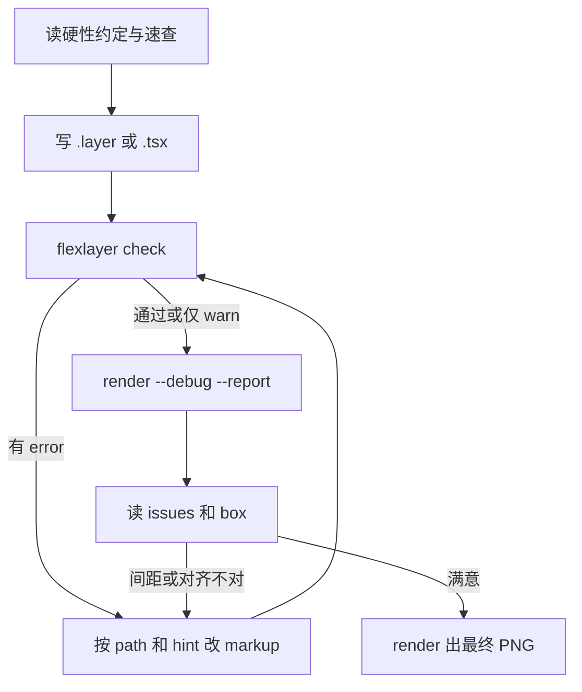

# Flex Layer：生成、验证与 AI 协作

本文是给模型的入口。标签与属性的正文只在 [SPEC.md](SPEC.md)；下面这张表是必须遵守的写法，和报告里的问题码一一对应。有数据、循环或动画时写 `.tsx`。效果图见 [docs/GALLERY.md](docs/GALLERY.md)。

## 1. 三层分工

Flex Layer 把**生成**和**渲染**分开，中间只交接一份 **`.layer` 文本**：

```text
.layer 文本 ─────────────────────────▶ check / debug / render → PNG
.tsx（JSX + 代码）──执行──▶ 同一棵节点树 ──┘
                         └── --emit ──▶ .layer 文本
```

| 层 | 做什么 | 不做什么 |
| --- | --- | --- |
| **生成** | 写 `.tsx`（`canvas.create`）或手写 `.layer` | 不算最终像素、不画 canvas |
| **验证** | 布局、问题码、元素表、调试图 | 不改源码 |
| **渲染** | 读节点树或 `.layer` → PNG + `report.json` | 不接 Vue 或 React |

`.layer` 仍是渲染器读的格式。`.tsx` 执行后得到同一棵树，语义、问题码和绘制都不变。推荐用 `canvas.create` 先量再摆，见第 3 节。

## 2. 硬性约定

规则正文在 SPEC。这里只列写错会怎样、应该改成什么。

| 规则 | 错误写法 | 正确写法 | 问题码 |
| --- | --- | --- | --- |
| HTML 用 `style`，`layer` 和图形用属性 | `<p font-size="40">`、`<circle style="fill:#fff">` | `<p style="font-size:40px">`、`<circle fill="#fff">` | `invalid-attr` |
| 标签一律小写 | `<Circle>`、`<Row>` | `<circle>`、`<div style="display:flex">`。大写标签会渲染并报 `info` | `non-canonical` |
| 嵌套 `layer` / `use` 不写 `background` | `<layer background="#fff">` | `<rect fill="#fff">`、HTML `background`，或 `<draw>` | `invalid-attr` |
| 排布用 `div` 的 `display:flex` | `<Column>` | `<div style="display:flex; flex-direction:column">` | `unknown-tag` |
| 线条放在 `layer` 里，用 `x1`…`d` | 线条直接放进 flex | `<layer><line x1 y1 x2 y2 /></layer>` | `invalid-child` |
| 文字的位置写在外包的 `layer` 上 | `<h1 x="120">` | `<layer x="120" y="64"><h1>…</h1></layer>` | `invalid-attr` |
| `layer`、`use`、`rect`、`box` 用 `x`、`y` | `<layer cx="120" cy="64">` | `<layer x="120" y="64">`。圆、椭圆、球仍写 `cx` `cy` | `invalid-attr` |
| 笔画贴齐定位点用 `anchor-box="ink"` | 用布局盒子当笔画边界 | `<layer x="76" y="40" anchor-box="ink">`。只写在 `layer` 和 `use` 上 | `ink-inset` |
| 镜头取舞台的一块，用 `view` | 用 `scale` 把整页放大，越界就报 `overflow-canvas` | `<layer width="1920" height="1080" view="200 80 960 540">` 包住舞台。章节和标注写在这层外面，用成片像素。`scale` 的支点仍是 `origin` | `view-outside` |
| 图片是 HTML | `<Image width="320">` | ``。`image` 同样可用 | `invalid-attr` |
| 作用于整棵子树的效果只写在 `layer` 上 | `<rect grade="lomo">`、`<p style="overlay:#000">` | `<layer grade="lomo" overlay="#00000066">` | `invalid-attr` |
| 调色先选预设再改一两项 | `grade="contrast 5"` | `<layer grade="lomo 0.8, fade 0.1">` | `invalid-attr` |
| 结构化数据只放 `data` | `values={[1, 2]}` 会变成字符串 | `data={{ values: [1, 2] }}`。`.layer` 写 `data='{"values":[1,2]}'`，`draw` 读 `el.data` | `invalid-attr`、`emit-data` |
| 故意出现的问题写 `expect` | 出血图仍报 error | `expect="overflow-canvas: 出血图"`。出现在该节点或子树里时降为 info；没出现报 `unused-expect` | `unused-expect` |
| 文字盒子里不要嵌套块级标签 | `<p><div>…</div></p>`、`<h1><p>…</p></h1>` | `<div><p>…</p></div>`。要横排、间距或交叉轴对齐再写 `display:flex` | `invalid-child` |
| 写了宽高的 `layer` 和文字并排放进 `div` | `<p><layer>…</layer></p>`、`<div><layer x="10" y="10" width="120" height="120">` | `<div style="display:flex"><layer width="120" height="120"><circle cx="60" cy="60" r="50" /></layer><p>…</p></div>`。图形用这一层的局部坐标。`.tsx` 同样写 | `invalid-child`、`invalid-attr` |
| 公式用 `<math>`，不要写进文字盒子 | `<p>因此<math><mi>x</mi></math></p>` | `<div style="display:flex"><span>因此</span><math><mi>x</mi></math></div>` | `invalid-child` |
| 公式只用带 MATH 表的字体 | `<math style="font-family:Kai">` | 不写 `font-family`，字母和运算符用 `STIXTwoMath`。说明文字用 `<mtext>`，跟外面的字体走 | `invalid-attr` |
| 整层裁切用 `<mask>`，里面直接写形状或 `` | 把 mask 写成属性，或放进 flex | `<layer><mask><circle cx="160" cy="90" r="90" /></mask>…</layer>`。省略 `fill` 为不透明白 | `invalid-child` |
| 透视写在父 `layer`，转动和 `z` 写在子元素 | `<rect perspective="900" rotateY="20">` | `<layer perspective="900"><rect rotateY="20" z="40" /></layer>` | `invalid-attr`、`flatten-3d` |
| 球体、长方体、拉伸和 glb 放在带 `perspective` 的 layer 里 | `<sphere r="40">` 没有视距 | `<layer perspective="700"><sphere cx="80" cy="80" r="40" /></layer>`。`model` 只写 `src`，尺寸写在外包 layer | `flatten-3d`、`missing-model` |

根节点 `<layer width height background>` 上的 `background` 是画布底色，只有这一处可以写。没写时不铺底色，PNG 里空出来的像素是透明的。要白底写 `background="#ffffff"`。

带 `perspective` 的 layer 里，没有网格时直接子元素按中心深度从远到近画，深度相同按文档顺序。出现 `sphere`、`box`、`extrude`、`model` 时这一层改用深度缓冲，近的盖住远的。不在透视里时 `z` 不改变顺序，并报 `flatten-3d`。

flex 的 `align-items` 默认 `center`（CSS 里是 `stretch`）。**column 忘写 `align-items` 会全部居中**：较窄的子项在交叉轴居中，和容器同宽的子项看起来仍贴着起点。左对齐写 `align-items:flex-start`。横排按文字基线对齐写 `align-items:baseline`（图片、`layer`、形状对齐到下边缘）。同一行被基线撑高后，`center` 和 `end` 的子项按新的行盒再排，`start` 仍贴着行的起点。竖排写了 `baseline` 按 `flex-start`。`letter-spacing` 可以写 `em`，按写这条声明的元素自己的字号换算后再继承。`justify-content` 只管本层主轴，写在子项上改不了它在父级交叉轴上的位置。`align-content` 默认 `flex-start`，管的是 `flex-wrap` 之后的多行，不是一行里的子项。`flex-wrap` 可以写 `wrap` 或 `wrap-reverse`。

没写 `display:flex` 的 `div` 里直接放 `p`、`h1`–`h3`、`div`、写了宽高的 `layer` 或其他非行内标签时，按块级从上到下排，文字块拉到这一列的宽度，不报 `invalid-child`。只放文字和行内标签时，`div` 仍是文字盒子。`p`、`h1`–`h3`、`span` 里嵌套块级标签或 `layer` 仍然报 `invalid-child`，但可以直接放 ``。放进 `div` 的 `layer` 写 `width`、`height`，位置由排布决定，这一层上不写 `x`、`y`。容器上的字号、字重、字体、颜色、字距和 `text-align` 会传给没写这些的 `p`、`div`、`span`；`h1`–`h3` 仍用自己的默认字号和字重。`em` / `i` 是斜体，`u` 加下划线。

## 3. 生成

推荐用 `.tsx` 先量再摆。`canvas.create` 是同步的，字体、图片和 Yoga 在这一次调用里备好，并在进程里记住。多帧渲染接着用，不会每帧重新准备。动画的 `component` 里可以调用。参数必须是 `<layer>`。

```tsx
/** @jsxImportSource flexlayer */
import { canvas } from 'flexlayer'

const page = { width: 720, height: 540 }

const title = canvas.create(
  <layer x={48} y={48} width={page.width - 96} color="#f4ecdf" font-family="Kai">
    <h1 style="font-size:160px; white-space:nowrap">春眠不觉晓</h1>
  </layer>,
)
const ball = canvas.create(
  <layer x={title.left + 40} y={title.bottom + 32} perspective="700" glow="40 #e8b04a88">
    <sphere cx="90" cy="90" r="90" fill="#e8b04a" />
  </layer>,
)
export default canvas.create(
  <layer width={page.width} height={page.height} color="#f4ecdf" font-family="Kai" safe="0">
    <rect x="0" y="0" width={page.width} height={page.height} fill="#0c1424" />
    {title}
    {ball}
  </layer>,
)
```

只写宽或只写高、且没有会换行的文字时，另一边按比例放缩，这个比例乘进已有的 `scale`。`scale` 可以写两个数，例如 `scale="1.2 0.8"` 或 `scale="-1 1"`；原来只有一个数时仍写回一个数。宽高都写了就是盒子。返回的节点带 `left`、`top`、`right`、`bottom`，这是没转之前的布局盒。转完之后的外接矩形在 `rotatedBox`，接着摆下一块用 `rotatedBox.bottom`。文字在 `text` 里，按节点分组，每一行有盒子和 `baseline`，字在 `lines[].chars`。一个字是只有一个字的一行。每个排进去的元素在 `elements` 里，带 `path`、`tag`、布局盒 `box` 和转完之后的 `ink`，坐标和 `text` 同一套；贴着某个圆或矩形摆下一块时用 `box`，躲开转过的图形用 `ink`。底色用铺满的 `<rect fill>`。形状用 SVG 的 `x y width height` 或 `cx cy rx ry`。`<g transform>` 把几笔收成一组。`<arrow>` 是内置组件。自定义标签用 `canvas.component` 注册，类型写在 `declare module 'flexlayer/jsx-runtime'` 里。声明的属性就是回调参数的类型，返回值可以是一个元素或数组。自定义字体先 `canvas.font(family, src)`，或把 `<font>` 写进正在量的那一层；相对路径按源文件目录解析。量到的盒子和最终排版不一致时报 `measure-mismatch`。例子：`examples/poster.tsx`、`examples/hello.tsx`、`examples/html-layer.tsx`。规范见 SPEC 第 15 章。

字体、图片、配色和效果名用 [docs/RESOURCES.md](docs/RESOURCES.md)。`font-family="Song"` 这种目录里的名字会自己下载，不要编造字体文件地址，也不要把 `fonts.googleapis.com` 的 CSS 地址写进 `<font src>`。

- 直接写 `.layer`：渲染器和 `--emit` 用的文本。静态单帧可以手写。速查见 [docs/CHEATSHEET.md](docs/CHEATSHEET.md)，例子在 [examples/](examples/)。
- 动画导出 `composition`（见 SPEC 第 13 章）。文件头写 `/** @jsxImportSource flexlayer */`，标签不用 import。`flexlayer check` / `render` 会执行它。`--emit out.layer` 把展开结果写回 `.layer`。`draw={(ctx, el) => ...}` 里只用 `ctx` 和 `el`，否则 `--emit` 报 `emit-draw`，并且不写出 `<draw>`。不要用 `Math.random` 或 `Date.now`。可重复的随机数用 `random(seed)` 或 `noise`。例子：`examples/slide.tsx`。
- 要从字体取出某个字的轮廓，`import { glyph } from 'flexlayer'`。`await glyph('春眠', { font: 'Kai', size: 120, weight: 700 })` 按码位返回数组，每项有 `text`、`d`、`font`、`size`、`weight`、字宽 `width`、字身高度 `height`、`baseline`、`ink` 和 `missing`。`d` 的原点在字身左上角，y 向下，单位是像素。字宽和字身高度来自字体，不来自路径外接框。缺字（`😀`、`𠀀`）`missing` 为 `true`，`d` 是同一个缺字方框。可变字体只出默认字重。见 SPEC 5.4。

```ts
import { renderLayer } from 'flexlayer'
const { png, report } = await renderLayer(source, { baseDir: process.cwd() })
```

从 `flexlayer` 拿出的就是这些。`renderFvg`、`checkFvg` 分别是 `renderLayer`、`checkLayer` 的别名。包名没有作用域。合并旧分支时，导入、`jsxImportSource` 和 `package.json` 的 `name` 以 `flexlayer` 为准，不要把旧的作用域名字合回来。合完在仓库根目录再跑一次 `npm install`，本地 `node_modules/.package-lock.json` 才会换成新名字。

新滤镜用 `registerFilter`。内置的 `grade` 和 `filter` 也走这个接口。像素滤镜默认只写在 `layer` 上，见 [SPEC.md 第 9.3 节](SPEC.md)。

| 导出 | 做什么 |
| --- | --- |
| `canvas.create` / `create` | 同步量一个 `<layer>`。`left` `top` `right` `bottom` 是没转之前的布局盒，`rotatedBox` 是转完之后的外接矩形。文字在 `text` 里，按行给出盒子和 `baseline`。每个元素的位置在 `elements` 里 |
| `canvas.font` | 先注册自定义字体，再 `create`。也可以把 `<font family src>` 写进正在量的那一层 |
| `canvas.component` / `registerComponent` | 按标签名注册组件。内置 `arrow` 也从这里来，`arrowComponent` 是它的函数 |
| `renderLayer` / `checkLayer` | 渲染 PNG，或只排版并出报告 |
| `glyph` | 按码位取轮廓 |
| `registerFilter` / `unregisterFilter` / `getFilter` / `listFilters` | 登记像素或画布滤镜。内置 `grade` 和 `filter` 也在这张表上 |
| `h` | 不用 JSX 时建节点 |
| `renderFrames` / `renderComposition` / `interpolate` / `spring` / `sequence` / `random` / `noise` / `zoomView` | 逐帧产出，或一次拿回全部 PNG。`interpolate` 可写多点区间和 `Easing`。`random`、`noise` 由 seed 决定。`zoomView(center, zoom, size)` 返回镜头的 `view` |
| `parseFvg` / `emitLayer` | 解析 `.layer` 文本，或把节点写回文本 |
| `buildReport` / `formatIssueLine` / `formatSourceLoc` | 报告、终端里的一行问题、源码位置 |
| `resources` | 字体、图片、配色、`grade` / `glass` / `blend` 的可用名字 |

## 4. 验证：由轻到重

### 4.1 `flexlayer check`

只跑布局与规则检查，不出图。有 **error** 时进程退出码为 1。

```bash
npx tsx src/cli.ts check examples/hello.layer
npx tsx src/cli.ts check examples/slide.tsx --frames 0-12 --step 3
```

不写 `--frames` 时，动画只抽第 0 帧、中间一帧和最后一帧。`--frames all` 检查每一帧。问题的 `frames` 是区间，例如 `[[0, 12]]`，`frame` 仍是第一次出现的帧号。

### 4.2 `flexlayer render --report`

```bash
npx tsx src/cli.ts render scene.layer -o scene.png --report scene.json
```

`--scale 0.5` 可缩小 PNG。动画用 `--frames out/` 边渲染边写 PNG，`--from`、`--to` 含端点。`--rgba -` 把原始像素写到标准输出，编码交给调用方。`renderFrames` 是对应的逐帧接口。

### 4.3 `flexlayer render --debug`

在同一张 PNG 上画出每个元素的布局盒子和着墨范围。先读报告里的 `issues`，再看图。

### 4.4 报告里关键字段

- **`path`**：如 `layer/layer[0]/div[0]/h1[0]`，与 `issues[].path` 一致。
- **`box`**：布局盒（含 padding），不含 `rotate`、`scale` 和透视。flex 的 `gap` 体现在相邻元素 box 之间的空隙。
- **`ink`**：旋转、缩放之后的着墨外接矩形。有透视时是投影后的外接矩形。像素对位和 `overflow-canvas` 看它，不看 `box`。
- **`quad`**：透视平面投影后的四个角（左上、右上、右下、左下）。斜着的平面落在哪儿看这里。
- **`effect`**：阴影、光晕、图层模糊或玻璃可能占用的范围。没有这些外扩效果时不写这个字段。`effect-clipped` 表示它画出了画布。`overflow="hidden"` 和 `<mask>` 已经裁掉的部分不算。
- **`issues`**：见 [SPEC.md 的问题码表](SPEC.md)。**error 必须修**，warn 视需求修。`grade` 回显的是预设展开后的参数。动画抽查合并后，`frame` 是第一次出现的帧，`frames` 是区间。

## 5. 工作流



1. 先对照第 2 节写，再看像素。
2. 用 `path` 定位，不要猜第几个 child。从 `.tsx` 来的报告还有 `source`（`hello.tsx:18:5`），直接改那一行。
3. 改 `gap` / `padding` 时看相邻元素的 box / ink。
4. 动态海报在 `.tsx` 里改数据，再跑 check。要看展开后的画面，加 `--emit out.layer`。
5. 字体、图片和配色用 [docs/RESOURCES.md](docs/RESOURCES.md)。目录里的字体名直接写 `font-family`。自己的文件才用根上的 `<font family src>`。
6. 合并进 `main` 时，把根 `package.json` 和 `package-lock.json` 的 `version` 补丁号加一（`0.2.0` → `0.2.1`）。每次合并都加。

## 6. 现象怎么查

| 现象 | 建议 |
| --- | --- |
| 元素跑出画布 | `overflow-canvas`（error）；看 `ink` 与画布尺寸。镜头写 `view`，取景窗外的不算。`view` 没被舞台盖住报 `view-outside`，`<g>` 按 transform 后的形状算，不用外接矩形。透视平面先看 `quad`，`box` 仍是没投影的布局盒 |
| 光晕被裁切 | `effect-clipped`；缩小 glow 或移动元素 |
| 字距和 `gap` 不一致 | 看 debug 里的 ink 间距 |
| flex 子项被挤爆 | 加宽 flex 容器或缩小子项 |
| 阴影或光晕看不见 | 查颜色与背景对比；看 `effect` 矩形 |
| 嵌套 layer 写了 background 没颜色 | 改成 `rect`、HTML `background` 或 `<draw>` |
| 短行居中、长行看起来左对齐 | column 没写 `align-items`，默认是 `center`。左对齐写 `align-items:flex-start`。`justify-content` 只管主轴 |
| 不知道改哪个节点 | 报告里的 `path`、`source` 和 `hint` |

## 7. 文档索引

| 文档 | 内容 |
| --- | --- |
| [SPEC.md](SPEC.md) | 唯一规范：标签、属性、效果、问题码 |
| [docs/CHEATSHEET.md](docs/CHEATSHEET.md) | 一页写法 |
| [docs/RESOURCES.md](docs/RESOURCES.md) | 能直接用的字体、Google 字体、图片、配色、效果名 |
| [docs/GALLERY.md](docs/GALLERY.md) | 效果对应哪张图的哪一格 |
| [docs/EFFECTS.md](docs/EFFECTS.md) | 算法与实现备注 |
| [docs/proposals/3D.md](docs/proposals/3D.md) | 3D 讨论。平面透视和 `sphere` / `box` / `extrude` / `model` 已接上，网格用自带三角形光栅；作者灯光还没有 |
| [README.md](README.md) | 安装与命令 |
| [skills/flexlayer/SKILL.md](skills/flexlayer/SKILL.md) | 给别的项目里的 agent 安装的 skill。本仓库仍以本文为准 |
| **本文** | 硬性约定和验证闭环 |

自动化测试：`npm test`（渲染器，含效果图与示例的检测）。`npm run gallery` 检测 gallery 与 examples，有 error 则失败，并重渲染说明里的图。
